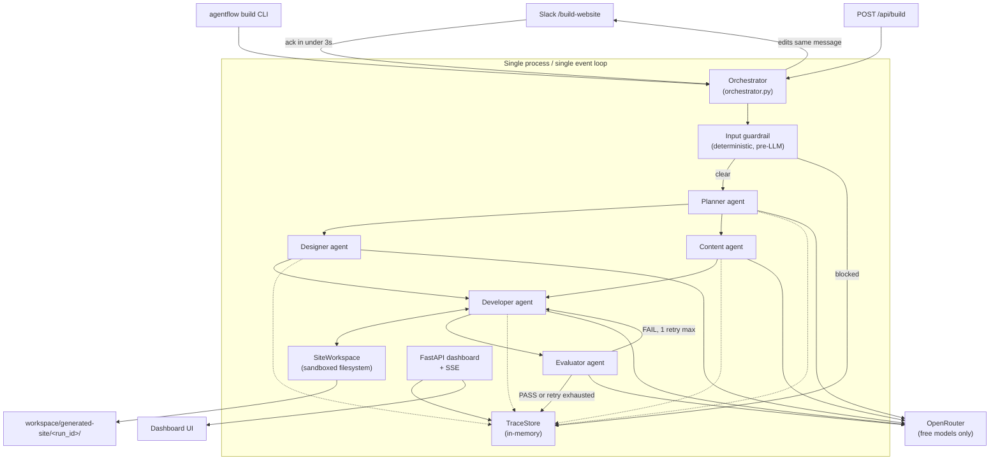

# Agent Flow

Agent Flow is a small, multi-agent AI system that turns a one-line natural-language
request — e.g. *"Build a modern landing page for an AI engineering company"* — into a
working static website. A Slack slash command triggers a five-agent pipeline (Planner,
Designer, Content, Developer, Evaluator) built on **PydanticAI**, running entirely on
**OpenRouter free models**, with an in-memory observability dashboard showing every LLM
call, token count, latency, guardrail event, and evaluation score in real time.

It was built as a self-contained interview demo (see `INSTRUCTIONS.md` for the original
spec and `docs/CONTRACT.md` for the interface contract the code was written against),
not a production system: the state is in-memory, the workflow runs in a single process,
and it deliberately uses only free-tier inference. The code is complete — 108 tests
(`uv run pytest -q`) — and this README documents what is actually implemented, not an
aspirational roadmap.

## Contents

- [Architecture](#architecture)
- [Multi-agent workflow](#multi-agent-workflow)
- [PydanticAI usage](#pydanticai-usage)
- [OpenRouter setup and model selection](#openrouter-setup-and-model-selection)
- [How FREE models are enforced](#how-free-models-are-enforced)
- [Slack configuration](#slack-configuration)
- [How to run](#how-to-run)
- [How to trigger a build](#how-to-trigger-a-build)
- [Guardrails](#guardrails)
- [Evaluation](#evaluation)
- [Token optimization](#token-optimization)
- [Observability](#observability)
- [Optional RAG](#optional-rag)
- [Known limitations](#known-limitations)

## Architecture

Everything runs in **one process, one asyncio event loop**: the FastAPI dashboard, the
Slack Socket Mode client (started as a background task in the FastAPI lifespan), and the
orchestrator all share a single in-memory `TraceStore`. There is no database, no queue,
and no second process — a design constraint, not an oversight (see
[Known limitations](#known-limitations)).



Key modules:

| Module | Responsibility |
|---|---|
| `agentflow/config.py` | Settings, live OpenRouter catalog fetch, free-pricing enforcement |
| `agentflow/models.py` | Pydantic contracts shared between agents (`WebsitePlan`, `DesignSpec`, `WebsiteContent`, `EvaluationResult`, …) |
| `agentflow/llm.py` | PydanticAI model factory, free→free failover, usage/cost capture |
| `agentflow/agents/*.py` | Planner, Designer, Content, Developer, Evaluator |
| `agentflow/orchestrator.py` | Workflow sequencing, concurrency, the one retry cycle |
| `agentflow/guardrails/` | Input guardrail (pre-LLM) and the sandboxed filesystem tool |
| `agentflow/observability/tracing.py` | `TraceStore`, `RunTrace`, `AgentSpan`, `LLMCall`, `GuardrailEvent` |
| `agentflow/slackapp.py` | Slack Socket Mode integration, message formatting |
| `agentflow/dashboard/app.py` | FastAPI routes + SSE stream over the trace store |
| `agentflow/cli.py` | `agentflow doctor \| build \| serve` |

## Multi-agent workflow

```
Planner
   │
   ├──▶ Designer ─┐
   └──▶ Content  ─┴─▶ Developer ─▶ Evaluator ─▶ PASS  → done
                                        │
                                        └▶ FAIL → Developer (one fix pass) ─▶ Evaluator → done
```

Designer and Content run **concurrently** via `asyncio.gather` — both depend only on the
`WebsitePlan`, so neither has to wait on the other (`agentflow/orchestrator.py`). If
evaluation fails, the Developer gets exactly **one** fix cycle with the evaluator's
issues/suggestions folded into its prompt; there is a hard `MAX_RETRIES = 1` — no loop, by
design, to bound latency, token spend, and cost.

Each agent is a thin, single-purpose module with a strongly typed contract:

| Agent | Input | Output |
|---|---|---|
| Planner | raw request text | `WebsitePlan` (name, description, target_audience, sections, visual_style) |
| Designer | `WebsitePlan` | `DesignSpec` (layout, visual_style, typography, color_direction, components) |
| Content | `WebsitePlan` | `WebsiteContent` (tagline, per-section heading/body/cta, footer) |
| Developer | `WebsitePlan` + `DesignSpec` + `WebsiteContent` (+ fix notes on retry) | `index.html` + `styles.css` written via sandboxed tools |
| Evaluator | `WebsitePlan` + generated files | `EvaluationResult` (score, passed, issues, suggestions, deterministic checks) |

## PydanticAI usage

Every agent is a `pydantic_ai.Agent` with a structured `output_type` — a Pydantic model,
never free-form text — and `retries=1` for output validation:

```python
def build_planner_agent() -> Agent[None, WebsitePlan]:
    return Agent(output_type=WebsitePlan, system_prompt=PLANNER_SYSTEM_PROMPT, retries=1)
```

The Developer agent is the exception: it has no `output_type` payload beyond a short
`DeveloperOutput` summary, and instead calls three PydanticAI **tools**
(`write_file`, `read_file`, `list_files`) that are thin wrappers around the sandboxed
`SiteWorkspace` — there is no shell/exec tool anywhere in the codebase. A rejected path
raises `pydantic_ai.ModelRetry`, which the agent sees as a tool error it can react to.

Models are built through `pydantic_ai.providers.openrouter.OpenRouterProvider` and
`pydantic_ai.models.openrouter.OpenRouterModel` — a dedicated OpenRouter model class
(confirmed against the installed `pydantic-ai==2.36.0`) that also captures OpenRouter's
`cache_write_tokens` field. All LLM calls funnel through `run_agent()` in `agentflow/llm.py`,
which builds the model, runs the agent, records a typed `LLMCall` (tokens, latency, cost,
served model) into the trace, and handles free→free failover.

## OpenRouter setup and model selection

Set `OPENROUTER_API_KEY` in `.env` (see `.env.example`). Model selection is centralized in
`agentflow/config.py`:

| Setting | Env var | Default |
|---|---|---|
| Default model (Planner/Designer/Content/Evaluator) | `OPENROUTER_MODEL` | `dots-studio/dots-3-note-preview:free` |
| Developer model | `OPENROUTER_MODEL_DEVELOPER` | `cohere/north-mini-code:free` |
| Failover chain | `OPENROUTER_FALLBACK_MODELS` | `minimax/minimax-m2.7:free,minimax/minimax-m3:free,nvidia/nemotron-3.5-lightning:free,google/gemma-4-31b-it:free,nvidia/nemotron-3-super-120b-a12b:free,z-ai/glm-5.2:free` |

**This is a deliberate, measured deviation from the spec's suggested
`OPENROUTER_MODEL=openrouter/free`.** `openrouter/free` is a real zero-priced router alias
— it's still fully supported as a config value — but live benchmarking (2 tool-calling
trials per model) showed it is unreliable as a *default*: in 1 of 2 trials it failed to
emit a tool call at all, and across the two trials it silently routed to
`nvidia/nemotron-3.5-content-safety:free` (a content-safety **classifier**, which replied
"User Safety: safe" instead of doing the task) and to an unrelated 2.6B model that produced
malformed JSON. Measured results, 2 trials each, tool-calling:

| Model | Result | Notes |
|---|---|---|
| `dots-studio/dots-3-note-preview:free` | 2/2 | ~5-7s, 512k context — **default** |
| `cohere/north-mini-code:free` | 2/2 | ~2-4s, code-tuned — **Developer agent** |
| `minimax/minimax-m2.7:free` | 2/2 | ~10s — failover |
| `nvidia/nemotron-3.5-lightning:free` | ok | failover |
| `nemotron-3-ultra-550b:free` | 1/2 | ~40s, too slow/unreliable for default |
| `google/gemma-4-31b-it:free`, `z-ai/glm-5.2:free` | HTTP 429 | rate-limited at test time — kept in the failover chain, still zero-priced |
| `thinkingmachines/inkling:free` | HTTP 403 | not entitled at test time |
| `openrouter/free` | unreliable | routed to a safety classifier or malformed-JSON model; **not the default** |

These numbers were measured, not assumed, and are the basis for choosing
`dots-3-note-preview:free` as the default and a code-tuned model for the Developer agent
specifically, with a 6-model free→free failover chain behind them.

## How FREE models are enforced

`agentflow/config.py:verify_models_are_free()` is the single enforcement point, run at
process startup (`agentflow doctor`/`build`/`serve`) and again lazily inside the LLM layer
as defense in depth:

1. Fetches OpenRouter's live model catalog (`GET /api/v1/models`), cached to
   `.cache/openrouter_models.json` for 24h.
2. For **every** configured model id (primary, developer, and every fallback), asserts the
   catalog entry exists **and** `pricing.prompt == 0` **and** `pricing.completion == 0`
   (parsed as floats).
3. On any violation, raises `PaidModelError` with the exact offending model(s) and the
   process exits non-zero. **It never substitutes a different model** — a paid or unknown
   model means the app refuses to start, full stop.
4. If the catalog is unreachable and `AGENTFLOW_ALLOW_OFFLINE_VERIFY=true`, model ids are
   accepted only if they end in `:free` or equal `openrouter/free`, and `pricing_status`
   is set to `OFFLINE-HEURISTIC` — the dashboard and Slack messages display this label
   verbatim, **never** "FREE", because it wasn't actually verified against live pricing.
5. Cost is always **computed** from catalog pricing (`tokens × price`), never hardcoded —
   for a verified-free model this naturally evaluates to `$0.00` rather than a faked
   constant.
6. Free→free failover happens only at request time, only on `403`/`429`/`5xx`/timeout,
   capped at 5 total attempts (primary + up to 4 fallback hops), and every hop is recorded
   as a trace event with `failover_from` set on the resulting `LLMCall`.

Run `uv run agentflow doctor` to see this in action without starting the server — it
prints the provider, both models, the fallback chain, and a per-model FREE/failed verdict.

## Slack configuration

Slack uses **Socket Mode** — no public HTTP endpoint or signing secret needed, so it works
from a laptop behind NAT. `slack/manifest.yaml` fully describes the app (the
`/build-website` slash command and the `commands`/`chat:write`/`chat:write.public` bot
scopes). Setup (full walkthrough in `slack/README.md`):

1. https://api.slack.com/apps → **Create New App** → **From an app manifest** → paste
   `slack/manifest.yaml` → install to your workspace.
2. Copy the bot token (`xoxb-...`, OAuth & Permissions) and the app-level token
   (`xapp-...`, Basic Information → App-Level Tokens, with the `connections:write` scope)
   into `.env` as `SLACK_BOT_TOKEN` and `SLACK_APP_TOKEN`.
3. `make serve` — Slack starts automatically inside the same process as the dashboard.

If either token is missing, Slack is simply disabled (a logged warning, not a crash) and
everything else — the dashboard, `agentflow build`, `/api/build` — still works. Progress is
reported by **editing one Slack message in place** (not reposting) as each agent moves
WAITING → RUNNING → COMPLETED, throttled to ~1 edit/second; terminal states are always
sent immediately. All links Slack posts are built from `PUBLIC_BASE_URL`, never
hardcoded to `localhost` (see `make tunnel` under [Known limitations](#known-limitations)).

## How to run

Requires Python 3.12 and [`uv`](https://docs.astral.sh/uv/).

```bash
uv venv --python 3.12
uv sync                              # or: uv pip install -e ".[dev]"
cp .env.example .env                 # then set OPENROUTER_API_KEY
uv run agentflow doctor              # verifies provider/model/pricing before anything else
uv run agentflow serve               # dashboard (+ Slack, if configured) on :8000
```

or via the `Makefile`:

```bash
make serve      # uv run agentflow serve
make doctor     # uv run agentflow doctor
make test       # uv run pytest -q
make tunnel     # cloudflared quick tunnel, for a public PUBLIC_BASE_URL
```

Run the test suite directly with `uv run pytest -q`, or a single test with
`uv run pytest tests/test_guardrails.py::test_path_escape -q`.

## How to trigger a build

Three equivalent entry points, all going through the same orchestrator:

```bash
# 1. CLI — no Slack needed
uv run agentflow build "Build a modern landing page for Agent Flow, an AI engineering company targeting enterprise technology leaders."
# or: make build REQUEST="..."

# 2. HTTP API (used by the dashboard, or curl it directly)
curl -X POST http://127.0.0.1:8000/api/build -H 'content-type: application/json' \
  -d '{"request": "Build a landing page for an AI engineering company"}'

# 3. Slack (once configured — see above)
/build-website Build a modern landing page for Agent Flow, an AI engineering company targeting enterprise technology leaders.
```

Each returns a `run_id` (`af-xxxxx`) immediately; the workflow runs in the background.
Watch progress at `http://127.0.0.1:8000/run/<run_id>` (or the `PUBLIC_BASE_URL`
equivalent), and open the finished site at `/site/<run_id>/`.

## Guardrails

The system's position, stated plainly: **the LLM is not the security boundary.**
Every restriction is enforced in deterministic code the LLM cannot talk its way around.

- **Input guardrail** (`agentflow/guardrails/input_guard.py`) — deterministic regex/keyword
  matching for prompt injection (`"ignore previous instructions"`, `"system prompt"`, …)
  and secret exfiltration, and it runs **before any LLM call**: a blocked request makes
  zero LLM calls, ever. Secret-related terms (`.env`, `credentials`, `api key`, `password`)
  are gated behind a nearby exfiltration verb (`read`, `dump`, `leak`, `send`, …) rather
  than matched as bare nouns, so a legitimate request like *"a landing page for a password
  manager startup"* is **not** blocked, while *"read my .env file"* is.
- **Filesystem guardrail** (`agentflow/guardrails/filesystem.py`, `SiteWorkspace`) — the
  **only** way the Developer agent touches disk. Every path is resolved and must stay
  inside `workspace/generated-site/<run_id>/`: absolute paths, `..` traversal, symlinks at
  any path component, and extensions outside `{.html,.css,.js,.svg,.json,.txt,.md}` are all
  rejected, plus a 256KB per-file cap and a 20-file cap. Every rejection records a
  `GuardrailEvent(kind="filesystem", blocked=True)` in the dashboard **and** raises
  `pydantic_ai.ModelRetry` so the calling LLM sees it as a tool error. There is no
  shell/exec tool anywhere in the codebase.
- **Output guardrail** — every agent's structured output goes through Pydantic validation
  via PydanticAI's `output_type`, with exactly one retry (`retries=1`) on validation
  failure; a second failure records `GuardrailEvent(kind="output")` and fails the span.
  No unlimited retries.

All guardrail events are visible in the dashboard's trace timeline, tagged by kind
(`input`/`filesystem`/`output`).

## Evaluation

`agentflow/agents/evaluator.py` keeps two evaluation styles explicitly separate — in the
`EvaluationResult` model and in the dashboard, never merged into one opaque number:

- **Deterministic checks** (pure Python, no LLM): `index.html`/CSS exist, non-trivial page
  size, `<title>`, `<nav>`, `<footer>`, planned sections mentioned in the HTML, and a small
  set of accessibility basics (`<html lang="...">`, exactly one `<h1>`, a `<main>` landmark,
  and non-empty `alt` text on any `` — the last one passes vacuously if there are no
  `` tags at all). These back up the judge's accessibility claims with something a
  human can actually point to.
- **LLM-as-Judge**: a separate model call scores 0–10 on requirement coverage, content
  quality, visual consistency, accessibility basics, and technical correctness, returning
  concrete `issues`/`suggestions`.

`passed = score >= 7 AND all required deterministic checks pass` — a high judge score
cannot paper over a missing `index.html` or a missing `<nav>`. On failure, the Developer
gets **exactly one** fix cycle (never more) with the evaluator's issues folded into its
prompt, deliberately bounded to control latency, token spend, cost, and reliability.

A real end-to-end run (`af-79031` in `workspace/generated-site/`) scored **7.5/10** and
passed: a 6.3KB `index.html` + 11.6KB `styles.css`, visually verified in a browser — dark
SaaS aesthetic, sticky nav, gradient hero, numbered service cards, an icon feature grid,
and three responsive breakpoints. That run took 5 LLM calls, 34,849 total tokens, $0.00,
and 108s wall-clock (see [Known limitations](#known-limitations) for why that's slower than
it should be).

## Token optimization

Six concrete techniques, all visible in the code rather than asserted:

1. **Context minimization by function signature**, not convention — `run_designer(run_id,
   plan)` structurally *cannot* receive the raw request or another agent's output, because
   those parameters don't exist. Same pattern for every agent (`orchestrator.py` §
   docstring spells out exactly what each agent receives).
2. **Concise, static system prompts** — each agent has one module-level prompt constant
   (under ~120 words), cleanly separated from the dynamic user content assembled per call
   — this is also what makes the prompts cache-ready (see [Observability](#observability)).
3. **Structured outputs** — every agent returns a typed Pydantic model instead of prose the
   caller would have to parse.
4. **Output budgets per agent** — `AGENT_MAX_TOKENS` in `agentflow/llm.py`: Planner 1500,
   Designer 1500, Content 2500, Developer 8000, Evaluator 2000. **Worth calling out
   explicitly**: the first version of these budgets (500/500/1200/4000/700) *failed most
   live runs*, because the default free models are reasoning models that burn 150–900+
   hidden reasoning tokens before emitting the actual JSON — capping output below that
   overhead doesn't save tokens, it kills the call and forces a retry, which costs *more*
   tokens overall. The current budgets, plus `openrouter_reasoning={"effort": "low"}` on
   the reasoning-heavy agents (not `"none"` — some reasoning-tuned models tie tool-call
   reliability to having *some* reasoning budget), were set after live measurement, not
   guessed upfront.
5. **Avoid unnecessary calls** — no agent runs speculatively; the workflow does exactly the
   LLM calls the plan needs.
6. **Parallel execution** — Designer and Content run concurrently via `asyncio.gather`
   (both need only the `WebsitePlan`), cutting wall-clock latency versus running them
   sequentially.

## Observability

Tracing is **in-memory only** — a `TraceStore` singleton (`agentflow/observability/tracing.py`)
holding one `RunTrace` per run, with `run_id`/`trace_id`, a pre-seeded `AgentSpan` per agent
(so the dashboard renders WAITING states immediately), and a chronological `TraceEvent`
timeline. Every LLM call is recorded as a typed `LLMCall`: `model_requested` vs
`model_served` (an OpenRouter router alias can serve a different model than requested —
both are recorded), input/output/total tokens, `cached_tokens`/`cache_write_tokens`,
latency, attempt number, `failover_from`, and a cost computed from catalog pricing. The
dashboard subscribes to live updates over Server-Sent Events (`GET /api/run/{run_id}/events`).

Two things are handled honestly rather than glossed over:

- **P50/P90 latency** (`TraceStore.latency_percentiles()`) requires at least 5 completed
  runs; below that it reports `samples < 5` and the dashboard shows **"Insufficient
  samples for P50/P90"** — never an interpolated or fabricated number.
- **Prompt caching**: the dashboard shows the real `cached_tokens` value from OpenRouter's
  `usage` payload whenever it's greater than 0. When it's 0 (the common case for these
  free models/providers — caching isn't guaranteed on every route), it says caching isn't
  being reported and that the prompt structure is merely **cache-ready** (static system
  prompt separated from dynamic user content) — it never claims caching happened when it
  didn't.

## Optional RAG

**Not implemented.** RAG was explicitly P3/optional in the spec and was skipped so it
would never delay the core Slack → Agents → Website → Evaluation path — the `knowledge/`
directory exists but is empty. The rest of the system was kept generic enough that RAG
could be added later without touching the workflow: Planner/Designer/Content/Evaluator
already take a single typed input object each, so a retrieval step producing a short
context string would plug into that same slot rather than requiring new plumbing.

## Known limitations

- **In-memory state only** — nothing persists across a process restart; every `RunTrace`
  is gone the moment `agentflow serve` stops.
- **Single process by design** — the Slack client, dashboard, and orchestrator share one
  in-memory store and one event loop (see [Architecture](#architecture)); this is
  intentional for a laptop demo, not an accident.
- **Free-tier daily quota** — the OpenRouter key is free-tier (~50 free-model requests/day).
  One workflow is 5–6 LLM calls, so realistically only **~8–10 runs/day** before hitting
  hard `429`s. Both default models were observed hitting 429 during development. The
  6-model free→free failover chain mitigates but does not eliminate this — OpenRouter
  raises this limit substantially for accounts holding credit, but this project
  deliberately stays strictly free rather than doing that.
- **Latency is dominated by free-model inference** — the measured end-to-end run above took
  108s, inflated by reasoning-model latency and failover hops after rate limiting. That's
  the honest number, not an optimistic one.
- **Slack/dashboard links default to `localhost`** — set `PUBLIC_BASE_URL` (e.g. via
  `make tunnel` / cloudflared) if you need them to work from another device.
- **Not deployable to serverless as-is** — Socket Mode needs a persistent outbound
  connection, the generated site is written to local disk (would need blob storage), and
  the workflow's background execution can exceed a typical function's lifetime. That said,
  `TraceStore` and `SiteWorkspace` are deliberate seams: swapping the former for a real
  datastore and the latter for blob storage would contain that migration without touching
  the agents or orchestrator.
